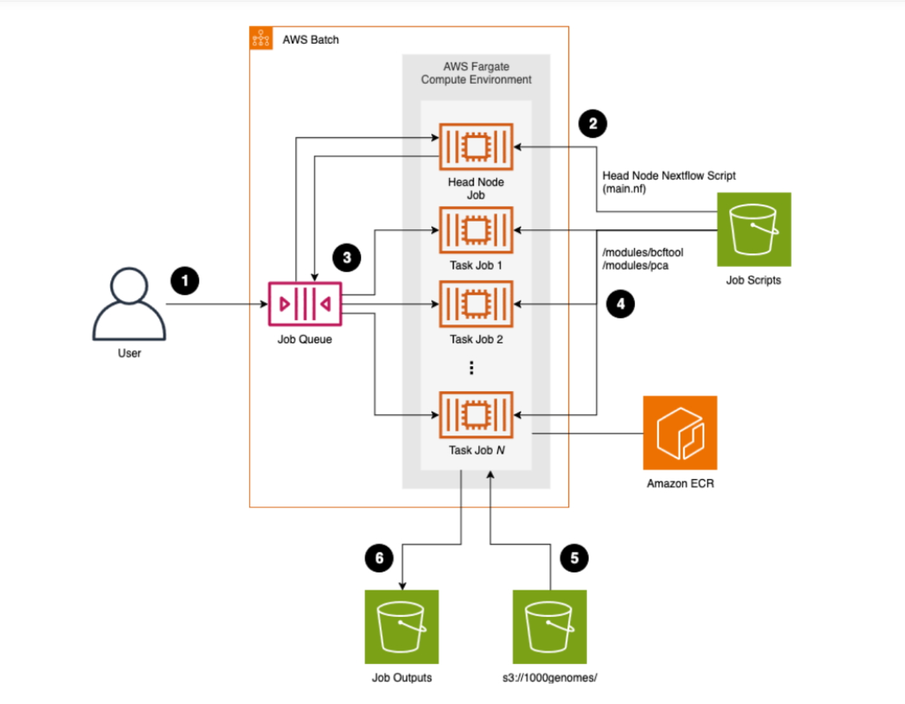

# Serverless Nextflow
A Nextflow pipeline is proposed to Examine genomic variation across populations with AWS. Here, both Nextflow head and task jobs are running on AWS Fargate, leveraging Spot instances, and automating infrastructure with Terraform, our approach overcomes the scalability, cost, and speed limitations of prior methods. 

## Solution Overview
The following diagram illustrates the how we orchestrate and run genomic variant analyses as Nextflow jobs using AWS Fargate, AWS Batch, and Amazon S3.

|  |

## Deployment
Here, we will demonstrate how to execute the source code from our GitHub repo to AWS cloud. 

### Prerequisites 
- Git
- Docker
- Terraform
- AWS CLI

### Instructions
- set up AWS cloud credential in your local PC.
  <Details>
  ```
  # eg. less ~/.aws/config 
  [default]
    region = us-east-1 
    output = json

  # eg. less ~/.aws/credentials 
  [default]
    aws_access_key_id=ASIAQT...X
    aws_secret_access_key=1mSq9i0+Vcr...A/u
    aws_session_token=IQoJ/...=
  ```
  </Details>
  
- Create a Terraform state s3 bucket
  
	Run the command `aws s3 mb s3:://<state_bucket_name>` to create the Terraform state S3 bucket, you can use any globally-unique valid S3 bucket name. This bucket will store the state of all the AWS resources that will be provisioned by Terraform.

- Update the state bucket name in aws.run/terraform/main.tf
  ```
  terraform {
  	backend "s3" {
  		bucket = <state_bucket_name>
  		...
  ```

- Run Terraform scripts while your local Docker deamon is running
  ```
  git clone https://github.com/csiro/1000genome.git
  cd aws.run/terraform
  terraform init
  terraform apply
  ```

- Run the aws.run/submit.sh
  ```
  cd aws.run && bash submit.sh
  ```
	This will perform the solution overview workflow and copy the scripts needed to run each task to S3 bucket and then launch the head node AWS Batch job, which will subsequently launch new downstream AWS Batch jobs as needed.
    
## Nextflow Pipeline

- update the parameter value within configuration file "./scripts/nextflow.config".
  - "chunk_size": the maximum sample number with each group during "SPLIT_SAMPLE" task
  - "rand_fraction" : the portion of variants to be randomly selected during "RAND_SELECT" task
  - "maf_interval" select variants fallen in the specified interval range.  
  - "container": the task job_definition refer to step 3 of AWS Cloud Infrastructure.   
 
- Submit Nextflow to cloud
  - update "submit.sh" following the step3 of  AWS Cloud Infrastructure. Here the Fargate cluster, docker image are already configured within job-queue and job-definition during terraform deployment. 
  - run `bash ./submit.sh`: it copys the nextflow scripts including configuration file to s3; and then submit Nextflow head job to aws batch. 
